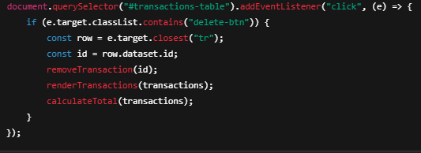

# Лабораторная работа №4. Работа с DOM-деревом и событиями в JavaScript

_Вариант 1_

## Цель работы

Ознакомить студентов с основами взаимодействия JS с DOM-деревом на основе веб-приложения для **учета личных финансов**.

## Условия

### Шаг 1. Настройка и структурирование проекта

1. Создайте корневую папку проекта.
2. В корневой папке создайте директорию `/src`, где будет храниться весь код.
   - `index.js` – главный файл, который будет импортировать другие модули.
   - `transactions.js` – модуль для работы с массивом транзакций.
   - `ui.js` – модуль для работы с DOM (отрисовка таблицы, формы и т. д.).
   - `utils.js` – вспомогательные функции (например, генерация ID, форматирование даты).
3. Создайте `index.html` в корневой папке и подключите `index.js` с `type="module"`.
4. Создайте `style.css` и подключите его к HTML.

### Шаг 2. Представление транзакции

1. Создайте массив `transactions`, который будет содержать объекты транзакций.
2. Каждый объект транзакции должен иметь следующие поля:
   1. `id`: уникальный идентификатор транзакции.
   2. `date`: дата и время добавления транзакции.
   3. `amount`: сумма транзакции.
   4. `category`: категория транзакции.
   5. `description`: описание транзакции.
   

### Шаг 3. Отображение транзакций

1. Создайте пустую HTML-таблицу, куда в дальнейшем Вы будете добавлять транзакции.
2. Таблица должна содержать следующие столбцы:
   - Дата и Время
   - Категория транзакции
   - Краткое описание транзакции
   - Действие (кнопка удаления транзакции)
   

### Шаг 4. Добавление транзакций

1. Создайте функцию `addTransaction()`,
2. В функции `addTransaction()`:
   - Создайте объект транзакции с данными из формы.
   - Добавьте созданный объект в массив `transactions`.
   - Создайте новую строку таблицы с данными из объекта транзакции и добавьте её в таблицу.
     - Если транзакция совершена на положительную сумму, то строка таблицы должна быть **зеленым цветом**, иначе **красным**.
     - В колонке `description` отображайте краткое описание транзакции (первые 4 слова).
     

### Шаг 5. Управление транзакциями

1. В каждой строке таблицы добавьте кнопку удаления.
2. При клике на кнопку удаления получите идентификатор транзакции и удалите соответствующую строку таблицы и удалите данную транзакцию из массива.
3. Обработчик событий на `клик` на кнопку определите для элемента `<table>`

### Шаг 6. Подсчет суммы транзакции

1. Напишите функцию `calculateTotal()`, которая будет вызываться после добавления или удаления транзакции.
2. Отобразите общую сумму на странице, например, в отдельном элементе.

### Шаг 7. Отображение полное транзакции

1. В файле `index.html` создайте блок для отображения подробного описания транзакции.
2. При нажатии на строку с транзакцией в таблице, отображайте полное описание в элементе `
` или `
` ниже таблицы.

### Шаг 8. Добавление транзакции

1. Добавьте форму на страницу для добавления транзакции в таблицу (для категории используйте `select`).
2. _Доп. задание_: валидируйте форму на наличие ошибок.

## Документирование кода

Код должен быть корректно задокументирован, используя стандарт `JSDoc`. Каждая функция и метод должны быть описаны с указанием их входных параметров, выходных данных и описанием функционала. Комментарии должны быть понятными, четкими и информативными, чтобы обеспечить понимание работы кода другим разработчикам.
